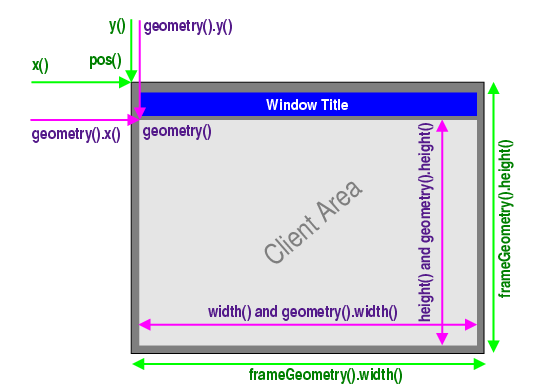

**问题1:有一个QWidget对象w,w.rect().height()和w.height()的区别**
回答:<br/>
#### 是一样的

[相关链接](https://blog.csdn.net/qq_45536742/article/details/129232069)

-------
**问题2:QPainterPath类有什么作用**
回答:<br/>
```
    QPainterPath painterPath;
    QPainterPath p;
    p.addRect(rect()); // 大窗口(限制范围)
    painterPath.addRect(m_cutDialog->geometry()); // 小窗口(裁剪范围)
    QPainterPath drawPath = p.subtracted(painterPath); // 获得大窗口减去小窗口的范围
```
QPainterPath用于创建和管理绘图路径,提供了一种方便的方式来描述和操作复杂的图形路径。<br/>
在本案例中QPainterPath用于取反绘图区域<br/>

-------
**问题3:有一个QWidget对象w,w的y()函数和pos().y()函数有什么区别**
回答:<br/>
#### 是一样的


-------
**问题3:重写mousePressEvent(QMouseEvent* event)和mouseMoveEvent(QMouseEvent* event)实现窗口拖动的原理**
回答:<br/>
```
void CutDialog::mousePressEvent(QMouseEvent* event)
{
    if (event->buttons() & Qt::LeftButton) {
        m_pt = event->globalPos() - this->geometry().topLeft();
    }
}

void CutDialog::mouseMoveEvent(QMouseEvent* event)
{
    if (event->buttons() & Qt::LeftButton) {
        this->move(event->globalPos() - m_pt);  // move函数移动当前控件(坐标相对于父控件的左上角)
    }
}

```
mouseMoveEvent函数中移动的 event->globalPos() - m_pt 相当于两次event->globalPos()相减再加上 this->geometry().topLeft(),而this->geometry().topLeft()表示起点。<br/>

-------
**问题4:重写mousePressEvent(QMouseEvent* event)和mouseMoveEvent(QMouseEvent* event)实现窗口拖动并且限制范围的原理**
回答:<br/>
```
void CutDialog::mousePressEvent(QMouseEvent* event)
{
    m_startPt = event->pos();
    m_mouseDown = event->button() == Qt::LeftButton;
}

void CutDialog::mouseMoveEvent(QMouseEvent* event)
{
    QPoint dragPoint = event->pos();
    if (m_mouseDown) {
        QPoint p = QPoint(pos().x() + dragPoint.x() - m_startPt.x(),pos().y() + dragPoint.y() - m_startPt.y());
        QPoint dragEnd = p;
        dragEnd.setX(dragEnd.x() + rect().width());
        dragEnd.setY(dragEnd.y() + rect().height());
        p.setX(p.x() < 0 ? 0 : p.x());
        p.setY(p.y() < 0 ? 0 : p.y());
        p.setX(dragEnd.x() > parentWidget()->width() ? parentWidget()->width() - rect().width() : p.x());
        p.setY(dragEnd.y() > parentWidget()->height() ? parentWidget()->height() - rect().height() : p.y());
        move(p);
    }
}
```
要搞清上面这段代码，首先进行简单化处理<br/>
```
void CutDialog::mousePressEvent(QMouseEvent* event)
{
    m_startPt = event->pos();
    m_mouseDown = event->button() == Qt::LeftButton;
}

void CutDialog::mouseMoveEvent(QMouseEvent* event)
{
    QPoint dragPoint = event->pos();
    if (m_mouseDown) {
        QPoint p = QPoint(pos().x() + dragPoint.x() - m_startPt.x(),pos().y() + dragPoint.y() - m_startPt.y());
        move(p);
    }
}
```
删除部分内容后基本功能可以实现，只是少了边界的限制，此时实现的功能和**问题3**中的代码实现的功能类似<br/>
但是原理是与**问题3**中的代码有区别的,**问题3**在pressEvent的时候就获取了窗口当前位置即this->geometry().topLeft(),之后计算的是moveEvent和pressEvent的globalPos()之间的距离,这个距离是会比较大的<br/>
而**问题4**中的代码在pressEvent的时候仅仅获取event坐标，而在moveEvent中的再实时获取**窗口当前位置**，当每次moveEvent触发的时候，计算的是moveEvent和pressEvent的oos()之间的距离,这个距离是很小的，然后更新窗口当前位置,使得下次在窗口当前位置的基础上再移动从而实现连续移动<br/>
**理解简单化的代码逻辑之后**可以得到，实际上删除的代码部分是在进行窗口的移动范围限制<br/>

-------
